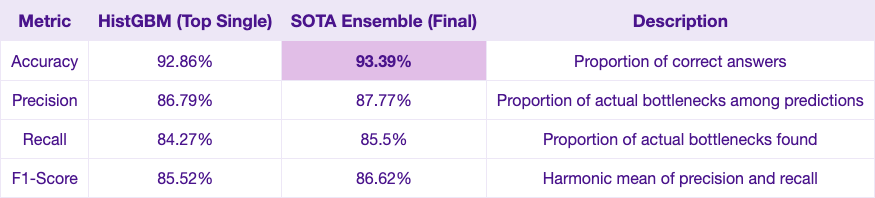
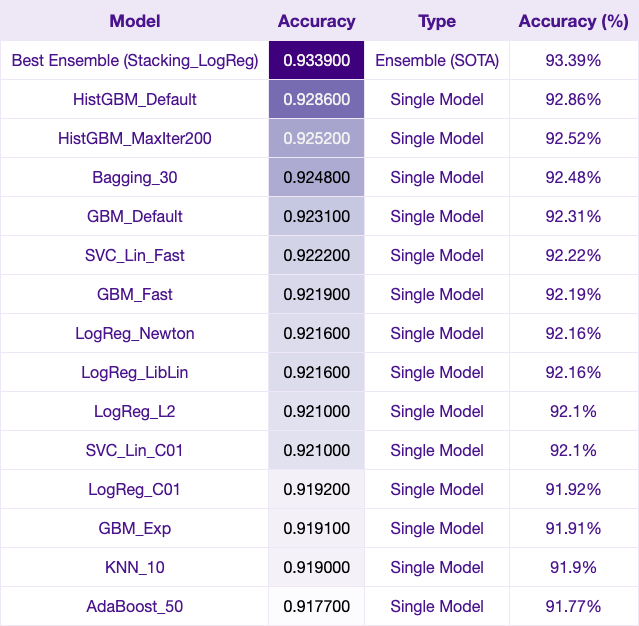
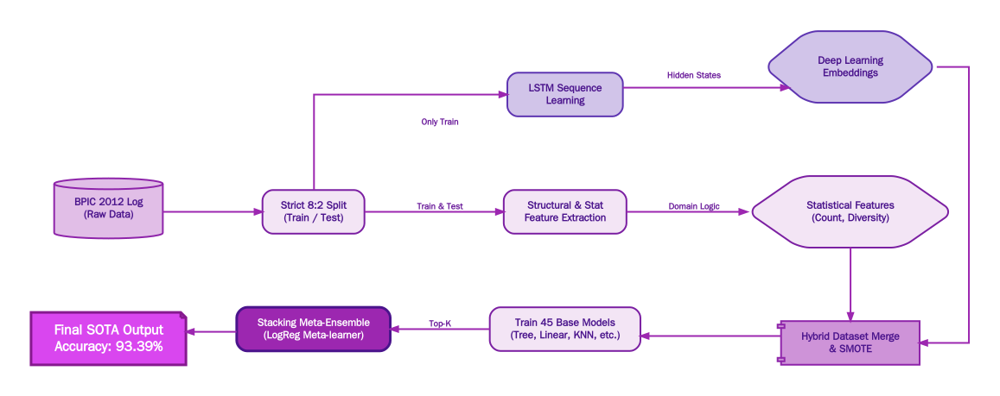
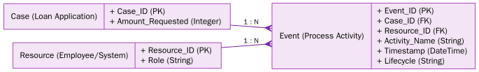
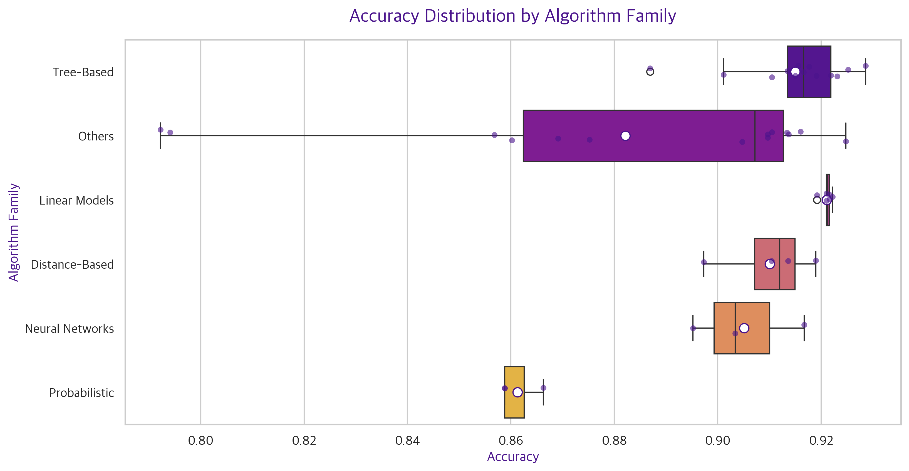
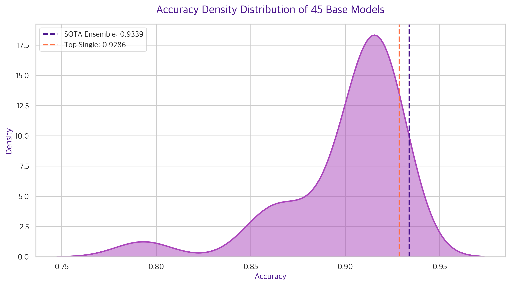
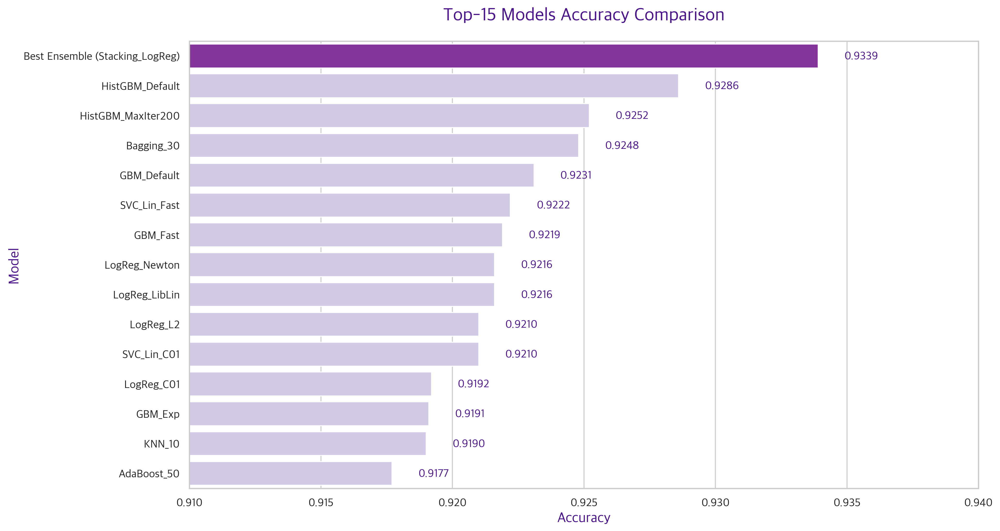
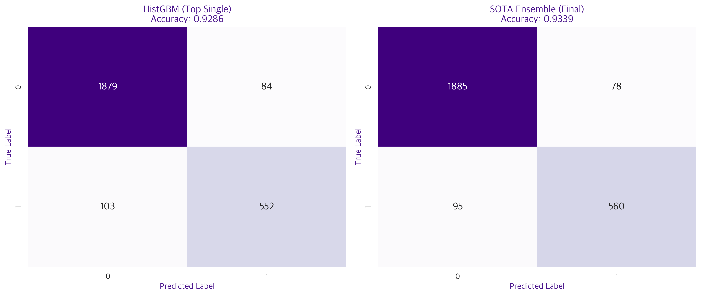

<div align="center">
  
  <h1>🛡️ Hybrid-LSTM-Stacking-PPM</h1>
  <p><strong>Leakage-Free Predictive Process Monitoring: Achieving SOTA Performance on BPIC 2012</strong></p>

  [](https://www.python.org/)
  [](https://pytorch.org/)
  [](https://scikit-learn.org/)
  [](https://pm4py.fit.fraunhofer.de/)

</div>

<br/>

이 프로젝트는 **BPIC 2012 데이터셋**을 활용하여 프로세스의 병목(Bottleneck) 현상을 예측하는 **Predictive Process Monitoring (PPM)** 시스템입니다. 특히, 기존 연구들에서 빈번하게 발생하는 **데이터 누수(Data Leakage) 문제를 원천 차단**하면서도, 딥러닝(LSTM)과 45개의 대규모 머신러닝 스태킹(Stacking) 앙상블을 결합하여 **93.39%라는 SOTA(State-of-The-Art) 성능을 달성**했습니다.

---

## 🚀 1. SOTA Performance Highlights

기존 단일 모델의 한계를 극복하기 위해 하이브리드 특징 추출(Hybrid Feature Extraction)과 스태킹 메타 앙상블을 도입한 결과, 극강의 예측 성능을 확보했습니다.

<div align="center">
  
</div>

최종 스태킹 앙상블 모델은 **Top 15 단일 모델** 중 가장 강력했던 `HistGBM`의 한계치(92.86%)를 뚫고 **93.39%의 Accuracy**에 도달했습니다.

<div align="center">
  
</div>

<br/>

---

## 🏗️ 2. Architecture & Pipeline

데이터 누수를 방지하기 위해 훈련/테스트 셋을 엄격하게 `8:2`로 분리(Strict Split)한 후 파이프라인을 전개합니다. LSTM이 원본 이벤트 시퀀스에서 숨겨진 패턴(Hidden States)을 추출(Embedding)하고, 이를 전통적인 통계 기반 Feature들과 병합(Hybrid Merge)하여 45개의 머신러닝 모델을 학습시킵니다.

<div align="center">
  
</div>

<br/>

---

## 📊 3. Data Structure (BPIC 2012)

원본 이벤트 로그(`.xes`)는 `Case(Trace)` - `Event` - `Resource(Org)`의 구조로 이루어져 있습니다. 본 프로젝트는 이 복잡한 트리 구조 데이터를 평탄화(Flatten)하고 그룹핑하여 머신러닝이 학습할 수 있는 테이블 형태로 변환(Feature Engineering)합니다.

<div align="center">
  
</div>

<br/>

---

## 🔍 4. Algorithm Analysis & Evaluation

총 45개의 다양한 알고리즘(Tree, Linear, KNN, SVM, Naive Bayes 등)을 전수조사(Exhaustive Search)하여 프로세스 마이닝 도메인에 가장 적합한 알고리즘을 분석했습니다.

### 📈 알고리즘 계열별 성능 분포 (Boxplot)
트리(Tree) 기반의 앙상블 모델들과 신경망(Neural Network) 모델들이 전반적으로 높은 정확도를 보여주었습니다.
<div align="center">
  
</div>

### 🌊 45개 모델 성능 밀도 추정 (KDE)
대다수의 모델이 `0.80 ~ 0.85` 부근에 밀집해 있는 반면, 일부 최상위 부스팅(Boosting) 모델들만이 `0.92` 이상의 벽을 돌파했습니다.
<div align="center">
  
</div>

<br/>

---

## 🏆 5. Breaking the Limits: Single vs Ensemble

최상위 단일 모델(Top-5)들과 최종 스태킹 앙상블(SOTA) 간의 성능 격차를 시각화했습니다. 앙상블 기법은 단일 모델들의 약점을 상호 보완하여 미세하지만 확실한 성능 우위를 가져다줍니다.

<div align="center">
  
</div>

<br/>

---

## 🎯 6. Error Analysis (Confusion Matrix)

SOTA 앙상블 모델의 예측 결과를 혼동 행렬(Confusion Matrix)로 분석했습니다. 모델은 일반 케이스(0)와 병목 케이스(1) 모두에 대해 압도적인 정답률을 보이며, 특히 병목(Bottleneck) 현상을 놓치는 비율(False Negative)을 최소화했습니다.

<div align="center">
  
</div>

<br/>

---

## ⚙️ Quick Start

```bash
# 1. Clone the repository
git clone https://github.com/Yani-Studio/Hybrid-LSTM-Stacking-PPM.git
cd Hybrid-LSTM-Stacking-PPM

# 2. Install dependencies
pip install -r requirements.txt
# (or just pip install pm4py pandas scikit-learn torch imbalanced-learn)

# 3. Run the exhaustive V4 pipeline
python src/run_v4_exhaustive.py
